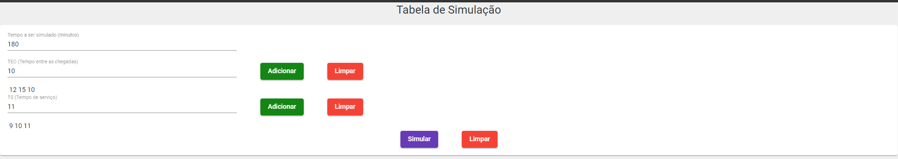

# Tabela de Simulação
Trabalho desenvolvido para a matérias de Simulação do Curso de Ciência da Computação da URI-Erechim 
    

## Executando a aplicação

Certifique-se que tenha instalado o NodeJS  em sua máquina.

Clone o repositório, acesse a raiz do projeto e instale as dependências.

> npm install

Para executar a aplicação, execute o comando abaixo:

> ng serve

## Autor

| [ @leticia-may](https://www.linkedin.com/in/let%C3%ADcia-may/)
| :---: |
